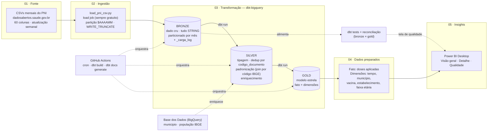

# Diagrama de arquitetura

Visão geral do pipeline, do CSV bruto até o dashboard, seguindo a numeração
usada no projeto (`01 Fonte → 02 Ingestão → 03 Transformação → 04 Dados
preparados → 05 Insights`).

## Por que essa forma (arquitetura medalhão)

> "Separa responsabilidade de reprocessamento — se a regra de negócio muda,
> reprocesso da bronze sem tocar na fonte; se a fonte muda o schema, o
> impacto fica isolado na silver."

Cada seta relevante do diagrama corresponde a uma decisão já justificada em
`docs/adr/`:

| No diagrama | Decisão | ADR |
|---|---|---|
| Fonte → Ingestão | Só CSV mensal, recarga por partição (não API REST) | [0002](adr/0002-ingestao-somente-csv-recarga-por-particao.md) |
| Onde os dados moram | BigQuery com billing habilitado (não sandbox) | [0003](adr/0003-bigquery-com-billing-habilitado.md) |
| Bronze → Silver → Gold | Arquitetura medalhão | [0004](adr/0004-arquitetura-medalhao.md) |
| Silver → Gold | CEP e código de paciente não avançam para a gold | [0005](adr/0005-lgpd-dados-pessoais-nao-avancam-para-gold.md) |
| Fonte escolhida | PNI / cobertura vacinal | [0001](adr/0001-escolha-da-fonte-de-dados.md) |

## Notas sobre o diagrama

- **`_carga_log`** (bronze) é a evidência de qualidade da ingestão: linhas do
  CSV, linhas carregadas, hash do arquivo, flag de reconciliação. Alimenta
  diretamente a tela de qualidade do Power BI.
- **GitHub Actions orquestra o dbt, não a ingestão** — os CSVs mensais ainda
  são baixados e carregados manualmente com `ingestion/load_pni_csv.py` (ver
  pendência sobre URL estável de download no handoff do projeto).
- **Base dos Dados** entra só na silver, como enriquecimento (município e
  população do IBGE) — é dataset público, já existe no BigQuery, não é
  ingerido pelo projeto.
- Este diagrama é o esboço inicial. Deve ser atualizado à medida que os
  modelos silver/gold forem escritos de fato (regra combinada de
  documentação incremental).
